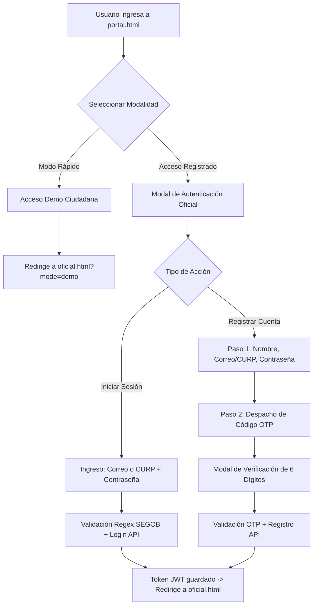

# KUCHE — Documentación Técnica de Frontend, Dashboard GIS y PWA

Guía técnica integral de la arquitectura frontend, componentes de interfaz de usuario, centros de mando geoespacial y aplicaciones web progresivas (PWA) de la plataforma **KUCHE** (*Monitoreo de Alumbrado Público e Infraestructura Urbana*).

---

## 1. Filosofía de Diseño e Identidad Institucional

La interfaz de usuario de **KUCHE** fue diseñada bajo estrictos lineamientos de sobriedad gubernamental, accesibilidad y eficiencia en campo:

1. **Cero Emojis (Zero-Emoji Policy):** Se eliminaron completamente los emojis en favor de iconografía vectorial SVG de alta definición, tipografías estructuradas y etiquetas de estatus institucionales (`[OFICIAL]`, `[DEMO]`, `[ALERTA]`, `[PENDIENTE]`, `[ATENDIDO]`).
2. **Logotipo Tipográfico Puro:** La marca KUCHE se presenta en **Montserrat Black / 800** con espaciado (*letter-spacing*) de `2px` a `3px`, eliminando isotipos de focos o alegorías genéricas para reflejar seriedad y modernidad institucional.
3. **Paleta Cromática Biocultural:**
   - **Vino / Guinda Institucional:** `#611232` y `#9B2247` (Pantone 7421 C / 7420 C).
   - **Dorado Metálico:** `#BC955C` y `#C59B27` (Acentos, bordes de distinción y halos de luminarias activas).
   - **Pizarra y Carbón Táctico:** `#0F1117`, `#161922` y `#1F2430` (Fondos de alto contraste con reducción de fatiga visual para trabajo nocturno).
   - **Barro Metzontla Popoloca:** `#A84A32` y `#C87D55` (Detalles de arraigo patrimonial).
4. **Respuesta Táctil y Micro-interacciones:** Indicadores de estado visuales, transiciones CSS aceleradas por GPU y modales accesibles con soporte para teclado y gestos táctiles móviles.

---

## 2. Mapa del Ecosistema Frontend

El repositorio comprende cuatro módulos web complementarios:

```text
dise-o_kuche/
├── portal.html                    # Portal Ciudadano y selector de acceso (Demo vs Oficial con OTP)
├── oficial.html                   # PWA de Campo con cámara, GPS, IA y reporte ciudadano obligatorio
├── dashboard.html                 # Centro de Mando GIS (Leaflet multi-capa, visor de fotos y métricas)
├── index.html                     # Portal principal e índice de acceso rápido
├── propuestas.html                # Matriz interactiva de variantes visuales y cédulas técnicas
├── PROPUESTAS_VISUALES_KUCHE.html # Catálogo biocultural y acervo de códices popolocas
├── backend_url.json               # Configuración dinámica del túnel activo (Cloudflare Tunnel / Local)
└── static/ & icons/               # Manifiesto PWA, iconos vectoriales y activos estáticos
```

---

## 3. Módulos y Flujos de Usuario

### 3.1 Portal Ciudadano y Autenticación Segura (`portal.html`)

El portal de bienvenida ofrece dos vías de entrada claramente delimitadas:



#### Características de Seguridad en Frontend:
* **Entrada Flexible Correo / CURP:** Detecta automáticamente si el usuario ingresó un correo electrónico válido o una CURP mexicana de 18 caracteres validada contra la expresión regular oficial de SEGOB:
  ```javascript
  const curpRegex = /^[A-Z]{4}\d{6}[HM][A-Z]{2}[B-DF-HJ-NP-TV-Z]{3}[A-Z0-9]\d$/;
  ```
* **Cooldown de Reenvío OTP:** Temporizador visible de 60 segundos que bloquea el botón para prevenir ataques de saturación (*OTP bombing*).
* **Bloqueo Local contra Fuerza Bruta:** Bloqueo reactivo de interfaz tras 5 intentos fallidos consecutivos, mostrando tiempo de espera restante al usuario.
* **Sanitización XSS:** Escape exhaustivo de entradas en el DOM mediante función nativa `escapeHtml()`.

---

### 3.2 Aplicación Web Progresiva de Campo (`oficial.html`)

Diseñada para operar en smartphones y tabletas tanto en vehículos de patrullaje como en recorridos a pie por brigadistas o vecinos inspectores.

* **Flujo de Video y Captura (10 Segundos):**
  - Conexión al API de medios del navegador (`navigator.mediaDevices.getUserMedia`) en resolución calibrada (1280x720).
  - Grabación en ráfaga asistida por temporizador de 10 segundos.
  - Streaming simultáneo hacia el canal WebSocket `/api/infraestructura/ws/detectar`.
* **Inferencia Asistida por IA:**
  - El modelo YOLO-World identifica el tipo de luminaria en el cuadro y sugiere la categoría técnica (Luminaria LED Vial, Farol Colonial, Luminaria Solar, etc.).
* **Reporte Humano Obligatorio:**
  - El sistema **no permite reportes mudos o automáticos**. La IA propone la categoría técnica, pero el ciudadano o brigadista debe ingresar obligatoriamente una descripción detallada de la anomalía observada (ej. *"Luminaria intermitente tras tormenta eléctrica"* o *"Brazo doblado por choque vehicular"*).
* **Georreferenciación Satelital:**
  - Adquisición continua de coordenadas GPS de alta precisión mediante `navigator.geolocation.watchPosition` con `enableHighAccuracy: true`.
* **Empaquetado y Envío Multipart:**
  - Compresión del fotograma en JPEG (calidad 85%) en un elemento `HTMLCanvasElement` y despacho multipart al endpoint `/api/infraestructura/registrar`.

---

### 3.3 Centro de Mando y Dashboard Geoespacial (`dashboard.html`)

Herramienta analítica de monitoreo en tiempo real pensada para pantallas de control municipal, operadores de despacho y supervisores de obra:

```text
┌──────────────────────────────────────────────────────────────────────────────┐
│  KUCHE  •  CENTRO DE MANDO Y SUPERVISIÓN DE ALUMBRADO PÚBLICO                │
├──────────────────────────────────────┬───────────────────────────────────────┤
│  PANEL LATERAL DE CONTROL            │  VISOR CARTOGRÁFICO MULTI-CAPA        │
│                                      │  (Leaflet.js Engine)                  │
│  - Tarjetas de Métricas en Vivo      │                                       │
│    * Total de Reportes               │  [Táctico Cyber] [Satélite] [Calles]  │
│    * Pendientes / En Proceso         │                                       │
│    * Atendidas / En Reparación       │  ┌─────────────────────────────────┐ │
│                                      │  │                                 │ │
│  - Filtros Dinámicos de Estatus      │  │        ● [Luminaria #3]         │ │
│                                      │  │                                 │ │
│  - Lista Scrollable de Incidencias:  │  │   ● [Luminaria #2]              │ │
│    * Tarjeta con ID y Fecha          │  │                                 │ │
│    * Tipo de Luminaria               │  │              ● [Luminaria #1]   │ │
│    * Miniatura de Foto               │  │                                 │ │
│    * Autor (Oficial o Demo)          │  └─────────────────────────────────┘ │
│    * Clic para enfocar en mapa       │                                       │
├──────────────────────────────────────┴───────────────────────────────────────┤
│  MODAL DE INSPECCIÓN DETALLADA:                                              │
│  [ Foto Full-HD ] [ Descripción Ciudadana ] [ Coordenadas GPS ] [ Google Maps]
└──────────────────────────────────────────────────────────────────────────────┘
```

#### Capacidades Cartográficas:
* **Mosaicos Libres Sin Clave API:**
  - **Modo Táctico Cyber Dark:** Mosaico OpenStreetMap invertido por hardware mediante filtro CSS de alto contraste (`invert(100%) hue-rotate(180deg) contrast(90%)`).
  - **Modo Satelital de Alta Resolución:** Cobertura satelital global provista por Esri World Imagery.
  - **Modo Urbano Estándar:** Cartografía vectorial rasterizada de OpenStreetMap.
* **Marcadores SVG Reactivos:** Marcadores circulares con aros pulsantes según la urgencia y estado de la incidencia.
* **Visor Modal de Evidencia:**
  - Al pulsar cualquier reporte, se despliega un diálogo emergente centrado que muestra:
    1. Fotografía capturada en campo con zoom al hacer clic.
    2. Descripción exacta escrita por el ciudadano o brigadista.
    3. Cuenta del autor responsable (`demo_ciudadano` o ID de usuario autenticado).
    4. Coordenadas GPS con enlace directo de navegación en Google Maps.
    5. Fecha y hora exacta de registro.

---

## 4. Despliegue en GitHub Pages y Sincronización Backend

El frontend está alojado y publicado mediante **GitHub Pages** en la rama `gh-pages` y `main`:

* **URL Pública:** [https://08nicks.github.io/dise-o_kuche/](https://08nicks.github.io/dise-o_kuche/)
* **Detección Automática de Backend:**
  - Al cargar la página, el frontend realiza una consulta asíncrona a `backend_url.json`.
  - Si el archivo contiene una URL de Cloudflare Tunnel válida (ej. `https://intense-shield-dress-spare.trycloudflare.com`), todas las peticiones a la API y WebSockets se dirigen dinámicamente a ese túnel seguro con cifrado TLS/HTTPS.
  - Si no hay túnel configurado o se trabaja en entorno local, conmuta automáticamente a `http://localhost:8000`.

---

## 5. Matriz de Compatibilidad de Navegadores

| Plataforma / Navegador | WebRTC Video | Geolocation GPS | Service Worker (PWA) | Aceleración Canvas |
| :--- | :---: | :---: | :---: | :---: |
| **Google Chrome (Android / Desktop)** | Compatible | Compatible | Compatible | Compatible |
| **Samsung Internet (Android)** | Compatible | Compatible | Compatible | Compatible |
| **Apple Safari (iOS 15.4+ / macOS)** | Compatible | Compatible | Compatible | Compatible |
| **Microsoft Edge (Windows / Xbox)** | Compatible | Compatible | Compatible | Compatible |
| **Mozilla Firefox (Mobile / Desktop)** | Compatible | Compatible | Compatible | Compatible |

---

## 6. Créditos y Licenciamiento

* **Desarrollo y Diseño:** [08Nicks](https://github.com/08Nicks) (Josué).
* **Librerías de Terceros:**
  - Leaflet.js (Licencia BSD de 2 cláusulas)
  - Google Fonts: Montserrat (Licencia SIL Open Font License 1.1)
  - OpenStreetMap & Esri World Imagery (Licencias abiertas para mosaicos)
* **Licencia de Código:** Distribuido bajo la Licencia MIT.
